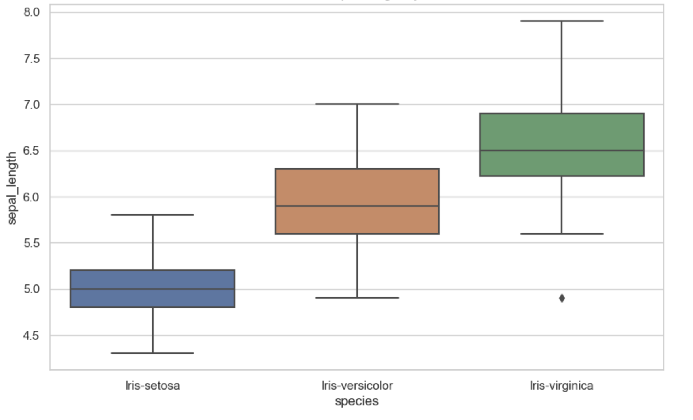

+++
draft = true
date = 2023-08-17
title = "Identifying Iris flowers using multi-class classification algorithm"
description = "using multi-class classification neural networks model to identify iris flower"
slug = ""
authors = ["Olumide Ogundele"]
tags = ["ml", "supervised learning", "classification algorithm"]
categories = ["machine learning"]
externalLink = ""
series = ["classification algorithm"]
+++

I am eager to write about this because it's my first Machine Learning model. After completing Machine Learning (ML)
specialization course by Andrew Ng, I wanted to reinforce the concepts I had learned before starting
the Deep Learning specialization. So, this will be the first project in a series of about 7 ML projects I need to do
before I proceed with Deep Learning.

## The problem

### Identify Irises

Irises have influenced the design of the French fleur-de-lis, are commonly used in the Japanese art of flower arrangement
known as Ikebana, and underlie the floral scents of the “essence of violet” perfume. They’re also the subject of
this well-known machine learning project, in which you must create an ML model capable of sorting irises based on five
factors into one of three classes: Iris Setosa, Iris Versicolour, and Iris Virginica.

To create a model capable of classifying each iris instance into the appropriate class based on four attributes:
sepal length, sepal width, petal length, and petal width.

### Choosing the Machine Learning Algorithm

Looking at the problem at hand, it is a classification problem, but in this case, it's not a binary classification of
yes or no, 0 or 1. Since we are to identifying three different flowers, it's a multi-class classification problem.
The best algorithm to use will be Logistic Regression, which is probably the single most widely used classification algorithm in the world.

Just to note, Linear regression is not a good algorithm for classification problems, the algorithm is about predicting a
number but not possible types of outcomes in this case.

### Understand your data through visualization

When you can visualize, understand, and know your data, it can give you more information about how to build your model,
see patterns that can help you make more informed decisions in choosing your ML algorithm, and also helps to know how to
transform the data in a way that can be passed as features (X) and targets (y) for the learning data for the model you are about to build.

A lot can go wrong with our ML model if the data is not good. The source of the dataset used is from the [UCI Machine Learning Repository Iris Data Set](http://archive.ics.uci.edu/dataset/53/iris).

#### Brief overview of the data

After downloading the dataset, it looks like this:


From the data, you can see it has 4 features and a target, which is the name of the flower. Also, we should visualize the
data to have a holistic view.


From the visualization above, we can deduce the following:

- Iris-setosa is the smallest in sepal-length, petal-length, and widest in sepal-width
- Iris-virginica is the largest in sepal-length, petal-length, and  just a bit smaller in width compared to Iris-setosa

More visualization using the sepal-length is shown below:



The above was achieved using this code:

```python
import csv
import matplotlib.pyplot as plt
import pandas as pd
import seaborn as sns

plt.style.use('./deeplearning.mplstyle')


data = []

with open("./iris/iris.data", newline='') as csv_file:
    csv_reader = csv.reader(csv_file)

    for row in csv_reader:
        if len(row) == 0:
            continue

        data.append(row)

columns = ["sepal_length", "sepal_width", "petal_length", "petal_width", "species"]
df = pd.DataFrame(data, columns=columns)

feature_columns = ["sepal_length", "sepal_width", "petal_length", "petal_width"]
# Convert data types to numeric
df[feature_columns] = df[feature_columns].apply(pd.to_numeric)
# Set the style for Seaborn
sns.set(style="whitegrid")

# Scatter Plot Matrix
sns.pairplot(df, hue="species")
plt.show()

# Box Plot
plt.figure(figsize=(10, 6))
sns.boxplot(x="species", y="sepal_length", data=df)
plt.title("Box Plot of Sepal Length by Class")
plt.show()

```

What the above code is doing is almost self-explaining:

- Read out and cleanup all the raw data and store them in a data list
- Create the columns of the visualized data using the features and also adding `species` for collective name of all the
flower types
- Convert the string type to float for the input data in the pandas frame
- The remaining part is plotting the data

At this point, I know the tools just enough to do what I need. When the time to dive deep comes, it'll be fun!
These python libraries are really awesome!

## Building the Model

Now moving from the data visualization to another interesting part which is the process that went into building the model.

Everything I did to build the model was all learned from Andrew Ng. I am just recreating the steps involved in building
all different models and choosing the right approach and machine learning algorithms required to achieve what I want and
tweaking those steps to the data I am dealing with to ensure a model with a high prediction rate.

Since the outcome we want from the model is to decide among 3 possible outcomes, in addition to the algorithm of choice,
there are some other algorithms like decision trees, XGBoost, that can also be used. But I am going to use an advanced
learning algorithm coupled with Logistic Regression.

We would be using Logistic Regression but not the type that determines two possible outcomes. The actual advanced
machine learning algorithm I will use is the Softmax Classification algorithm. The softmax regression algorithm is a
generalization of logistic regression, which is a binary classification algorithm, to the multiclass classification context.

Our model will be built with a neural network with softmax output with some optimization applied.

Basically, if we are looking for 3 possible outcomes, we can encode the outcome using 0, 1, 2, i.e.

```python

flowers = {
    "Iris-setosa": 0,
    "Iris-versicolor": 1,
    "Iris-virginica": 2,
}
```

We will expect our model to predict these numbers to identify the flower, and that will be extracted from the encoding.

## Neural Networks

A multiclass neural network generates N outputs. One output is selected as the predicted answer and in this case, it will
generate three outputs (0 - 2).

### Dataset

Let's start by loading the dataset for this problem.

- The steps shown below loads the data into variables `X` (features) and `y` (targets)

```python
# The length of features and targets must be equal.
features = [] # X 2-D array of features for the flowers
targets = [] # y, the targets or flower from 0 to 2

with open("./iris/iris.data", newline='') as csv_file:
    csv_reader = csv.reader(csv_file)

    for row in csv_reader:
        if len(row) == 0:
            continue

        features.append(row[:len(row)-1])
        flower_id = flowers[row[len(row)-1]]
        targets.append(flower_id)

X = np.array(features, dtype=float)
y = np.array(targets)
```

- Each training examples becomes a single row in our data matrix `X`.

The code below prints the first element in the variables `X` and `y`.

```python
print ('The first element of X is: ', X[0])
print ('The first element of y is: ', y[0])
print ('The last element of y is: ', y[-1])
```

```shell
The first element of X is:  [5.1 3.5 1.4 0.2]
The first element of y is:  0
The last element of y is:  2
```
#### Check the dimensions of the variables

Another way to get familiar with your data is to view its dimensions. Let's print the shape of `X` and `y` and see how
many training examples you have in your dataset.

```python
print ('The shape of X is: ' + str(X.shape))
print ('The shape of y is: ' + str(y.shape))
```

```shell
The shape of X is: (150, 4)
The shape of y is: (150,)
```

- This gives us a 150 x 4 matrix `X` where every row is a training example of an Iris flower type.

- The second part of the training set is a vector `y` of 150 elements that contains labels/targets for the training set
as shown above with the flower encoding.

### Model Representation

The neural network architecture I will use is shown in the figure below:


- This has two dense layers with ReLU activations followed by an output layer with a linear activation.
- Recall that the inputs are flower dimensions or size attributes
- Since the size attributes are of size 4, this gives us `4` inputs
- The parameters have dimensions that are sized for a neural network with `25` units in layer 1, `15` units in layer 2
and `3` output units in layer 3, one for each flower type encoding (0 - 2).

Therefore, the shapes of `W`, and `b`,  are:

- layer1: The shape of `W1` is (4, 25) and the shape of `b1` is (25,)
- layer2: The shape of `W2` is (25, 15) and the shape of `b2` is: (15,)
- layer3: The shape of `W3` is (15, 3) and the shape of `b3` is: (3,)

### Tensorflow Model Implementation

Tensorflow models are built layer by layer. A layer's input dimensions are calculated for you.
You specify a layer's *output dimensions* and this determines the next layer's input dimension. The input dimension of
the first layer is derived from the size of the input data specified in the `model.fit` statement below.

>**Note:** It is also possible to add an input layer that specifies the input dimension of the first layer. For example:

```python
tf.keras.Input(shape=(400,)),    #specify input shape
```

### Softmax Placement

Even though the algorithm used is a Softmax regression, there's a slight improvement and this is the reason:

Numerical stability is improved if the softmax is grouped with the loss function rather than the output layer during
training. This has implications when *building* the model and *using* the model.

Building:
* The final Dense layer should use a 'linear' activation. This is effectively no activation.
* The `model.compile` statement will indicate this by including `from_logits=True`.

```python
loss=tf.keras.losses.SparseCategoricalCrossentropy(from_logits=True)
```
* This does not impact the form of the target. In the case of `SparseCategorialCrossentropy`, the target is the expected
value, 0 - 2.

Using the model:
* The outputs are not probabilities. If output probabilities are desired, apply a softmax function.

Below, using Keras [Sequential model](https://keras.io/guides/sequential_model/) and [Dense Layer](https://keras.io/api/layers/core_layers/dense/)
with a ReLU activation to construct the three layer network described above.

```python
import tensorflow as tf
from tensorflow.keras.models import Sequential
from tensorflow.keras.layers import Dense

import logging
logging.getLogger("tensorflow").setLevel(logging.ERROR)
tf.autograph.set_verbosity(0)

tf.random.set_seed(1234) # for consistent results
model = Sequential(
    [
        tf.keras.Input(shape=(4,)),
        Dense(units=25, activation="relu"),
        Dense(units=15, activation="relu"),
        Dense(units=3, activation="linear"),
    ], name = "iris_categorizer_model"
)

model.summary()
```

```shell
Model: "iris_categorizer_model"
_________________________________________________________________
Layer (type)                Output Shape              Param #
=================================================================
dense_3 (Dense)             (None, 25)                125

dense_4 (Dense)             (None, 15)                390

dense_5 (Dense)             (None, 3)                 48

=================================================================
Total params: 563
Trainable params: 563
Non-trainable params: 0
_________________________________________________________________
```

The parameter counts shown in the summary correspond to the number of elements in the weight and bias arrays as shown below.

Let's further examine the weights to verify that Tensorflow produced the same dimensions as we calculated above.

```python
[layer1, layer2, layer3] = model.layers

#### Examine Weights shapes
W1,b1 = layer1.get_weights()
W2,b2 = layer2.get_weights()
W3,b3 = layer3.get_weights()
print(f"W1 shape = {W1.shape}, b1 shape = {b1.shape}")
print(f"W2 shape = {W2.shape}, b2 shape = {b2.shape}")
print(f"W3 shape = {W3.shape}, b3 shape = {b3.shape}")
```

```shell
W1 shape = (4, 25), b1 shape = (25,)
W2 shape = (25, 15), b2 shape = (15,)
W3 shape = (15, 3), b3 shape = (3,)
```

The following code:
* defines a loss function, `SparseCategoricalCrossentropy` and indicates that softmax should be included with the  loss calculation by adding `from_logits=True`)
* defines an optimizer. A popular choice is Adaptive Moment (Adam)

```python
model.compile(
    loss=tf.keras.losses.SparseCategoricalCrossentropy(from_logits=True),
    optimizer=tf.keras.optimizers.Adam(learning_rate=0.001),
)

history = model.fit(
    X,y,
    epochs=30
)
```

```
Epoch 1/30
5/5 [==============================] - 1s 1ms/step - loss: 0.0591
Epoch 2/30
5/5 [==============================] - 0s 2ms/step - loss: 0.0457
Epoch 3/30
5/5 [==============================] - 0s 2ms/step - loss: 0.0476
Epoch 4/30
5/5 [==============================] - 0s 2ms/step - loss: 0.0485
Epoch 5/30
5/5 [==============================] - 0s 17ms/step - loss: 0.0466
Epoch 6/30
5/5 [==============================] - 0s 2ms/step - loss: 0.0468
Epoch 7/30
5/5 [==============================] - 0s 3ms/step - loss: 0.0461
Epoch 8/30
5/5 [==============================] - 0s 2ms/step - loss: 0.0462
Epoch 9/30
5/5 [==============================] - 0s 2ms/step - loss: 0.0467
Epoch 10/30
5/5 [==============================] - 0s 2ms/step - loss: 0.0466
Epoch 11/30
5/5 [==============================] - 0s 2ms/step - loss: 0.0462
Epoch 12/30
5/5 [==============================] - 0s 3ms/step - loss: 0.0469
Epoch 13/30
5/5 [==============================] - 0s 2ms/step - loss: 0.0467
...
Epoch 29/30
5/5 [==============================] - 0s 2ms/step - loss: 0.0463
Epoch 30/30
5/5 [==============================] - 0s 2ms/step - loss: 0.0462
```

#### Epochs and Batches

In the `compile` statement above, the number of `epochs` was set to 30. This specifies that the entire dataset should
be applied during training 30 times.  During training, you see output describing the progress of training that looks like this:

```
Epoch 1/30
5/5 [==============================] - 1s 1ms/step - loss: 0.0591
```

The first line, `Epoch 1/30`, describes which epoch the model is currently running. For efficiency, the training dataset
is broken into 'batches'. The default size of a batch in Tensorflow is 32. There are 150 examples in our data set
or roughly 5 batches. The notation on the 2nd line `5/5 [====` is describing which batch has been executed.


#### Loss (Cost)

To track the progress of gradient descent by monitoring the cost. Ideally, the cost will decrease as the number of
iterations of the algorithm increases. Tensorflow refers to the cost as `loss`. Above, you saw the loss displayed each
epoch as `model.fit` was executing. The [.fit](https://www.tensorflow.org/api_docs/python/tf/keras/Model) method returns
a variety of metrics including the loss. This is captured in the `history` variable above. This can be used to examine
the loss in a plot as shown below:

```python
def plot_loss_tf(history):
fig, ax = plt.subplots(1,1, figsize = (4,3))

fig.canvas.toolbar_visible = False
fig.canvas.header_visible = False
fig.canvas.footer_visible = False

ax.plot(history.history['loss'], label='loss')
ax.set_ylim([0, 0.07])
ax.set_xlabel('Epoch')
ax.set_ylabel('loss (cost)')
ax.legend()
ax.grid(True)
plt.show()

plot_loss_tf(history)
```


### Prediction

Here comes the moment we've been waiting for! To identify the flower type by feeding the model some of the data we trained
it on. To make a prediction, use Keras `predict`.

```python
# use the model to predict a Iris-virginica flower
flower_encoding = ["Iris-setosa","Iris-versicolor", "Iris-virginica"]
iris_virginica = X[len(X)-1]
iris_setosa = X[0]

prediction = model.predict(iris_virginica.reshape(1, 4))
print(f" predicting a 2: \n{prediction}")
index = np.argmax(prediction)
print(f" Largest Prediction index: {index}: {flower_encoding[index]}")

prediction = model.predict(iris_setosa.reshape(1, 4))
print(f" predicting a 0: \n{prediction}")
index = np.argmax(prediction)
print(f" Largest Prediction index: {index}: {flower_encoding[index]}")
```

Tadaa!

```shell
1/1 [==============================] - 0s 66ms/step
predicting a 2:
[[-57.94001    -6.19593    -2.4283934]]
Largest Prediction index: 2: Iris-virginica
1/1 [==============================] - 0s 24ms/step
predicting a 0:
[[ 27.813759   8.864102 -31.010174]]
Largest Prediction index: 0: Iris-setosa
```

A cool way will be to put this model behind an API and a UI to display the Iris flowers depending the attribute data received.

That's all folks, I definitely learnt more writing about this. View the complete [project](https://github.com/Lumexralph/identify-iris-flower) for reference.
